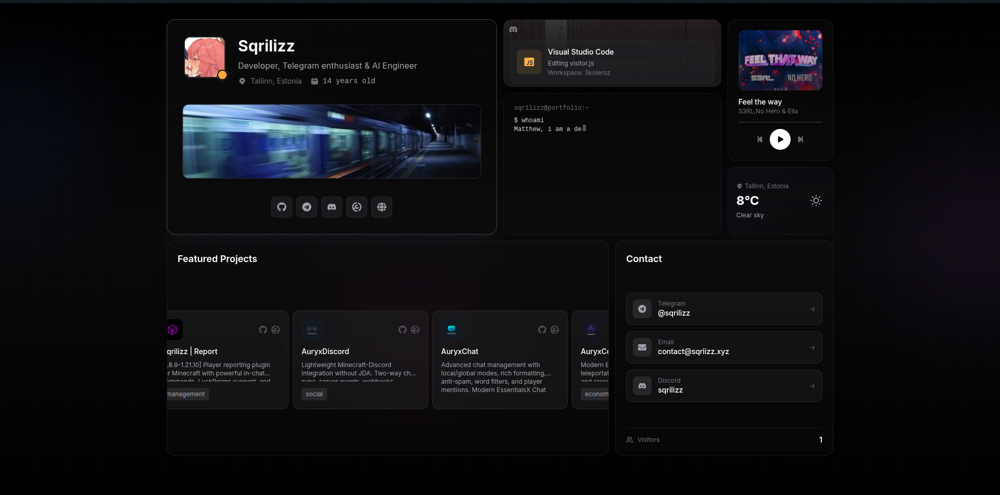

# Portfolio Template



Bento grid portfolio with Discord status, projects, music player, and more.

## Setup

```bash
npm install
npm run dev
```

## Config

`src/components/bento/HeroCard.jsx` - name, birthdate, bio, links

`src/config/discord.js` - Discord user ID and banner

`src/config/projects.js` - GitHub/Modrinth usernames

`src/components/bento/MusicCard.jsx` - music tracks

`src/components/bento/SkillsCard.jsx` - tech stack icons

`index.html` - meta tags and og:image

## Environment

`.env.local`:
```env
VITE_ACCUWEATHER_API_KEY=
VITE_MODRINTH_TOKEN=
```

## Visitor Counter (Optional)

[Setup guide](docs/VISITOR_COUNTER.md) - requires Vercel KV

## Deploy

```bash
npm run build
```

Vercel, Netlify, or any static host.
